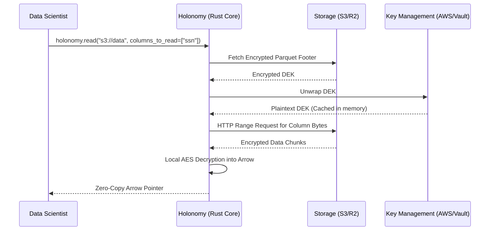

# 1. Introduction & Core Concepts

## 1.1. What is Holonomy?
Holonomy is a high-performance, in-process Privacy Shield specifically designed for analytical engines like DuckDB, Polars, and Pandas. It solves a critical tension in modern data engineering: how to process highly sensitive data without losing the performance of zero-copy vectorized engines.

**The Client-Side Encryption, Zero-Copy Philosophy:**

- **Client-Side Encryption**: All cryptographic operations occur strictly within your local CPU context. Your plaintext data and your decrypted Data Encryption Keys (DEKs) never leave your environment. Holonomy leverages Key Management Systems (KMS) strictly for "Envelope Encryption" (unwrapping encrypted keys), meaning the KMS provider never sees your actual data.
- **Zero-Copy**: Instead of decrypting data to disk or into standard Python memory (which requires expensive serialization), Holonomy decrypts data directly into native **Apache Arrow** memory buffers. This allows tools like Polars and DuckDB to execute relational queries against the decrypted data natively via Arrow FFI (Foreign Function Interface), minimizing memory overhead.

## 1.2. The Core Architecture
Holonomy is fundamentally built to decouple raw storage from analytical computation. 

### Hybrid Layer Design
Holonomy uses a three-tier hybrid architecture:

1. **Python DX Wrapper**: A streamlined API (`holonomy.read()`, `holonomy.scan()`, `holonomy.write()`, `holonomy.writer()`) designed for seamless integration into standard Jupyter or Python workflows.
2. **Rust Core**: A hyper-optimized systems backend built on `tokio` (for asynchronous I/O and S3 integration) and `arrow-rs` (for memory structures). This layer guarantees memory safety and enables aggressive concurrency when streaming massive datasets.
3. **Apache Arrow Memory Bridge**: By exposing `PyArrowType<arrow::array::ArrayData>`, Holonomy hands direct memory pointers back to Python, allowing instantaneous integration with C++/Rust based engines like Polars.

### Cryptographic Envelope Encryption
The cornerstone of Holonomy's security is Envelope Encryption.

- **Data Encryption Key (DEK)**: Your actual Parquet columns are encrypted using a unique DEK via Parquet Modular Encryption (AES-GCM-SIV).
- **Key Encryption Key (KEK)**: The DEK itself is encrypted using a master KEK securely stored in AWS KMS, Azure Key Vault, or HashiCorp Vault. 
- During a read operation, Holonomy pulls the encrypted DEK, asks the KMS to unwrap it, and caches the plaintext DEK securely in memory (protected by `ZeroizeOnDrop`) to perform hyper-fast streaming decryption.

## 1.3. Security Philosophy & Limitations

Holonomy is designed as a **"Soft Governance"** engine, not a strict, hardened security instrument. When faced with a trade-off between absolute cryptographic isolation and analytical performance (or Developer Experience), Holonomy actively chooses performance and DX. 

It is critical for engineering teams to understand the following architectural limitations:

### 1. Thick-Client Architecture (The Internal Attacker)
Holonomy runs locally as a thick client within the data analyst's execution environment (e.g., a Jupyter Notebook or a local container). Because it executes locally, it is not designed to defeat a determined, malicious internal attacker who has administrative or root-level access to their own machine. If a user can attach a memory debugger (like `gdb`), dump the kernel RAM, or intercept the Python process, they can extract the plaintext data after Holonomy has legitimately decrypted it. 

Holonomy's primary goal is to enforce access controls, apply column masking, and prevent accidental data leakage for well-intentioned actors—not to act as a hardware security module.

### 2. Memory Accessibility & `ZeroizeOnDrop`
To achieve its signature "Zero-Copy" performance, Holonomy must hold both the Data Encryption Keys (DEKs) and the resulting plaintext data in standard RAM. 

- While Holonomy rigorously uses `ZeroizeOnDrop` to securely wipe keys from Rust memory the exact millisecond they go out of scope, those keys are still transiently accessible in memory during active decryption.
- Furthermore, the resulting decrypted data is intentionally handed off as a native Apache Arrow pointer to Python. This memory is not cryptographically isolated (e.g., it is not stored in a secure enclave like Intel SGX) because isolating it would destroy the zero-copy performance benefits.

### 3. Asynchronous Telemetry
Holonomy broadcasts access logs (Audit events) to a centralized telemetry endpoint. Because Holonomy runs on the edge (the analyst's machine), a malicious user with control over their local network stack could theoretically block outbound HTTP requests to the telemetry sink, bypassing the audit trail. Audit logging should be considered "best-effort" governance rather than mathematically guaranteed compliance.